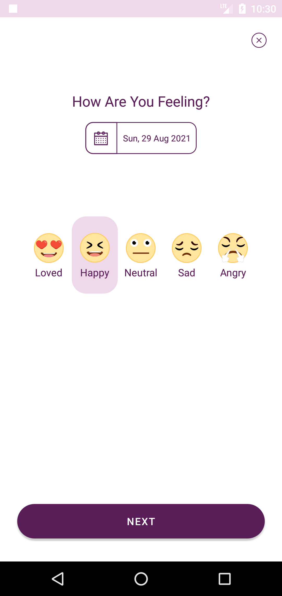
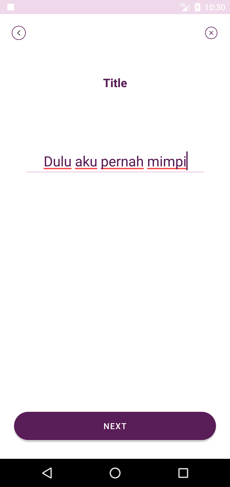
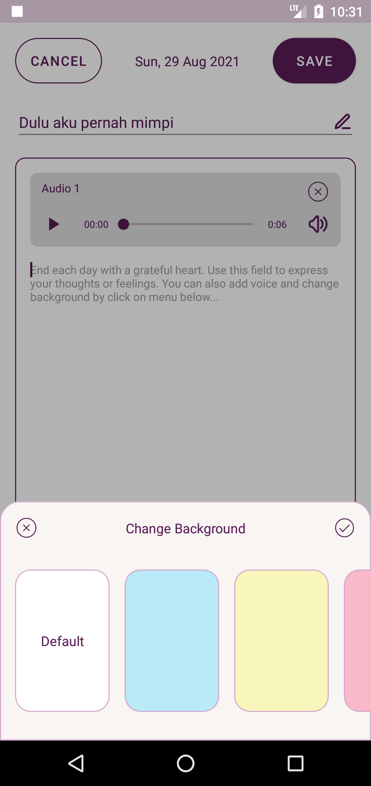
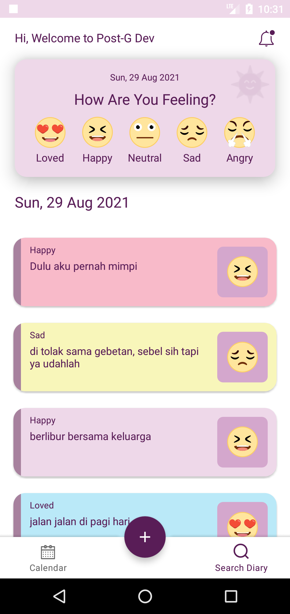
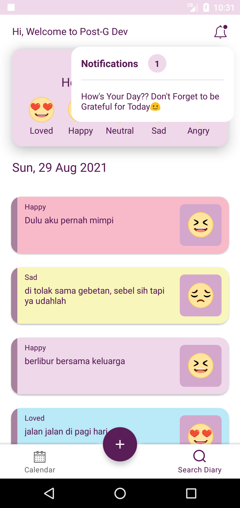
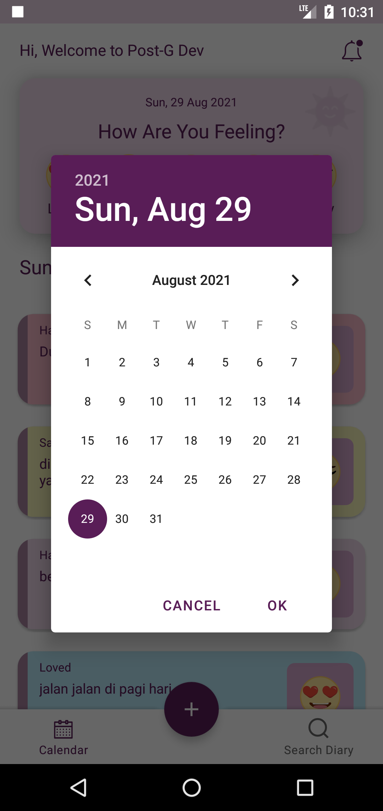
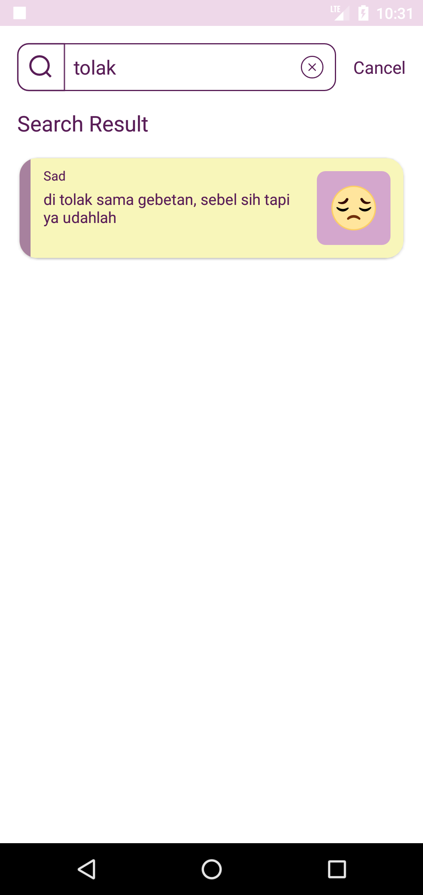

# Post-G

App Jurnal with Firebase Firestore

This project using the Architecture Components:

- MVVM
- Lifecycle-aware components
- ViewModels
- LiveData
- Navigation
- ViewBinding

## Screenshots

  
  
  
  
  
  
  
  

## Development Roadmap

- [x] [Kotlin](https://kotlinlang.org/)
- [x] [Lifecycle-aware components](https://developer.android.com/topic/libraries/architecture/lifecycle)
- [x] [ViewModels](https://developer.android.com/topic/libraries/architecture/viewmodel)
- [x] [LiveData](https://developer.android.com/topic/libraries/architecture/livedata)
- [x] [Navigation](https://developer.android.com/topic/libraries/architecture/navigation)
- [x] [DataBinding](https://developer.android.com/topic/libraries/data-binding)
- [x] AlarmManager
- [x] Firebase Firestore
- [x] Firebase Storage
- [x] Firebase Crashlytics
- [x] Firebase Analytics

## Features

- [x] Search Jurnal
- [x] List Jurnal
- [x] Detail Jurnal
- [x] Filter Jurnal by Calendar pick
- [x] Record Jurnal by Audio
- [x] Notification Remainder
- [x] Save Jurnal